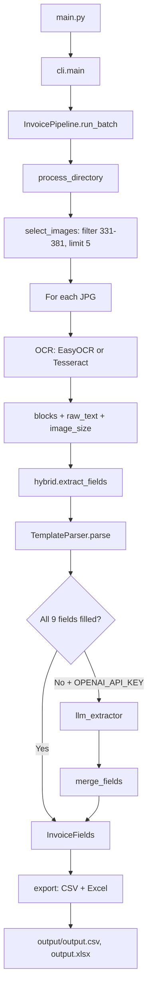

# Invoice Field Extractor — Full Documentation

Hybrid Python solution for extracting structured fields from **fixed-layout** invoice images (Kaggle: [High-Quality Invoice Images for OCR](https://www.kaggle.com/datasets/osamahosamabdellatif/high-quality-invoice-images-for-ocr)).

**Pipeline:** OCR (EasyOCR or Tesseract) → Rule-based parser → Optional LLM (only if fields missing) → CSV / Excel.

---

## Table of contents

1. [End-to-end flow](#1-end-to-end-flow)
2. [Project structure](#2-project-structure)
3. [Constants reference](#3-constants-reference)
4. [Setup and commands](#4-setup-and-commands)
5. [File-by-file guide](#5-file-by-file-guide)
6. [Function reference](#6-function-reference)
7. [API endpoints](#7-api-endpoints)
8. [Output fields](#8-output-fields)
9. [Troubleshooting](#9-troubleshooting)

---

## 1. End-to-end flow

### Batch mode (CLI)

```
python main.py --excel
```



### Web UI mode

```
python main.py --serve
```

Open http://127.0.0.1:8000 → user picks OCR → `POST /api/process` → same pipeline as above → table in browser + download links.

### Per-image steps (detail)

| Step | Module | What happens |
|------|--------|----------------|
| 1 | `image_selection` | Pick files matching `batch1-*.jpg`, IDs 331–381, apply limit |
| 2 | `ocr/*` | Read image; return text blocks with x/y positions |
| 3 | `parser/layout` | Group blocks into lines; split seller (left) / client (right) |
| 4 | `parser/template_parser` | Match labels from `template.yaml`; parse SUMMARY table for totals |
| 5 | `hybrid` | If any field empty → call OpenAI to fill gaps only |
| 6 | `export` | Write rows to CSV and Excel |

---

## 2. Project structure

```
cloud & ai/
├── main.py                          # Entry point (adds src to path, calls cli)
├── requirements.txt                 # Python dependencies
├── pyproject.toml                   # Package metadata
├── .env.example                     # Optional OPENAI_API_KEY
├── README.md                        # This file
│
├── config/
│   └── template.yaml                # Label definitions for parser
│
├── data/
│   └── images/                      # Place invoice JPGs here
│
├── output/
│   ├── output.csv                   # Generated CSV
│   ├── output.xlsx                  # Generated Excel
│   └── output_latest.xlsx           # Fallback if output.xlsx is open in Excel
│
├── static/
│   └── index.html                   # Simple web UI
│
└── src/invoice_extractor/
    ├── constants.py                 # All configuration
    ├── cli.py                       # Command-line interface
    ├── pipeline.py                  # Orchestrates batch processing
    ├── hybrid.py                    # Parser + optional LLM
    ├── export.py                    # CSV / Excel writers
    ├── image_selection.py           # Filter images by batch ID
    ├── llm_extractor.py             # OpenAI gap-fill
    ├── models.py                    # Data classes
    │
    ├── ocr/
    │   ├── __init__.py              # create_ocr(), check_ocr_engine()
    │   ├── easyocr_engine.py        # EasyOCR implementation
    │   └── tesseract_engine.py      # Tesseract implementation
    │
    ├── parser/
    │   ├── layout.py                # Line grouping, sections
    │   └── template_parser.py       # Field extraction logic
    │
    └── api/
        └── app.py                   # FastAPI + REST endpoints
```

---

## 3. Constants reference

File: `src/invoice_extractor/constants.py` — **edit this file** to change behavior.

| Constant | Default | Purpose |
|----------|---------|---------|
| `ROOT` | auto | Project root directory |
| `IMAGE_FROM_ID` | `331` | First invoice number in filename (`batch1-0331.jpg`) |
| `IMAGE_TO_ID` | `381` | Last invoice number in range |
| `IMAGE_LIMIT` | `5` | Max images per run (`0` = all in range) |
| `IMAGE_PATTERN` | `batch1-*.jpg` | Glob pattern for input files |
| `INPUT_DIR` | `data/images` | Folder containing invoice images |
| `OUTPUT_DIR` | `output` | Output folder |
| `OUTPUT_CSV` | `output/output.csv` | CSV output path |
| `OUTPUT_XLSX` | `output/output.xlsx` | Excel output path |
| `TEMPLATE_PATH` | `config/template.yaml` | Parser label config |
| `STATIC_DIR` | `static` | Web UI files |
| `OCR_ENGINE_DEFAULT` | `"easyocr"` | Default OCR if not specified |
| `OCR_LANGUAGES` | `["en"]` | EasyOCR languages |
| `OCR_GPU` | `False` | Use GPU for EasyOCR (needs CUDA) |
| `OCR_MAX_WIDTH` | `1400` | Resize wide images before OCR (speed) |
| `LLM_ENABLED` | `True` | Allow LLM step (still only if fields missing) |
| `LLM_MODEL` | `"gpt-4o-mini"` | OpenAI model name |
| `API_HOST` | `127.0.0.1` | Web server host |
| `API_PORT` | `8000` | Web server port |
| `TESSERACT_CMD` | `C:\Program Files\...` | Path to `tesseract.exe` on Windows |

---

## 4. Setup and commands

### Install

```powershell
cd "D:\Sharmila\Mine\cloud & ai"
python -m venv .venv
.\.venv\Scripts\activate
pip install -r requirements.txt
pip install -e .
```

### Tesseract (optional, for faster OCR)

1. Install from https://github.com/UB-Mannheim/tesseract/wiki  
2. Set `TESSERACT_CMD` in `constants.py` if not on PATH  

### Optional LLM

```powershell
$env:OPENAI_API_KEY = "sk-..."
```

LLM runs **only** when the parser leaves one or more fields empty.

### Commands

| Command | Description |
|---------|-------------|
| `python main.py --excel` | Batch: EasyOCR, CSV + Excel, settings from constants |
| `python main.py --excel --ocr tesseract` | Batch with Tesseract |
| `python main.py --excel --no-llm` | Parser only, no OpenAI |
| `python main.py --serve` | Web UI at http://127.0.0.1:8000 |
| `python main.py -i data\images --excel` | Custom input folder |

### Dataset

Copy Kaggle images `batch1-0331` … `batch1-0381` into `data/images/` (or nested subfolders).

---

## 5. File-by-file guide

### `main.py`

- Adds `src/` to Python path.
- Calls `cli.main()`.
- **Purpose:** Single entry point for the project.

---

### `constants.py`

- All paths, image batch range, OCR/LLM/API settings.
- **Purpose:** One place to configure the project (no scattered magic numbers).

---

### `cli.py`

| Function | Purpose |
|----------|---------|
| `main()` | Parse args; run batch or start uvicorn server |

**CLI flags:** `--serve`, `--excel`, `--ocr`, `--no-llm`, `-i`, `-v`

---

### `pipeline.py` — Orchestrator

| Class / method | Purpose |
|----------------|---------|
| `InvoicePipeline.__init__` | Validate OCR engine, load template, create OCR instance |
| `process_image` | OCR one image → `extract_fields` → `ProcessingResult` |
| `process_directory` | Find images, filter by ID/limit, process each |
| `run_batch` | Full run: process all → `write_csv` → `write_excel` |

---

### `hybrid.py` — Parser + LLM bridge

| Function | Purpose |
|----------|---------|
| `load_template` | Load YAML label config |
| `fields_complete` | Return `True` if all 9 fields are non-empty |
| `extract_fields` | Run parser; call LLM **only** if fields incomplete and API key set |

---

### `export.py`

| Function | Purpose |
|----------|---------|
| `_dataframe` | Build pandas DataFrame from successful results |
| `write_csv` | Save `output/output.csv` |
| `write_excel` | Save `output/output.xlsx`; use `output_latest.xlsx` if file locked |

---

### `image_selection.py`

| Function | Purpose |
|----------|---------|
| `extract_batch_number` | Parse `331` from `batch1-0331.jpg` |
| `select_images` | Filter by start/end ID; apply limit |

---

### `llm_extractor.py`

| Function | Purpose |
|----------|---------|
| `extract_from_text` | Send OCR text to OpenAI; get JSON with 9 fields |
| `merge_fields` | Copy LLM values **only** into empty parser fields |

---

### `models.py` — Data structures

| Class | Purpose |
|-------|---------|
| `OcrBlock` | One text region: text + bounding box + confidence |
| `TextLine` | Horizontal line of `OcrBlock`s |
| `InvoiceFields` | 9 extracted fields + `filename` |
| `ProcessingResult` | Result per image: fields, success, error |

| Constant | Purpose |
|----------|---------|
| `CSV_COLUMNS` | Column order for output file |
| `FIELD_KEYS` | Internal field names for LLM/merge |

---

### `ocr/__init__.py`

| Function | Purpose |
|----------|---------|
| `create_ocr` | Return `EasyOcrEngine` or `TesseractEngine` instance |
| `check_ocr_engine` | Return error string if engine unavailable |

---

### `ocr/easyocr_engine.py`

| Class / method | Purpose |
|----------------|---------|
| `EasyOcrEngine.__init__` | Configure GPU flag |
| `reader` (property) | Lazy-load EasyOCR model (slow first time) |
| `read_image` | Resize → grayscale → OCR → list of `OcrBlock` + full text |

---

### `ocr/tesseract_engine.py`

| Function / class | Purpose |
|------------------|---------|
| `_configure_tesseract` | Set `tesseract_cmd` from `TESSERACT_CMD` |
| `tesseract_available` | Check if Tesseract is installed |
| `TesseractEngine.read_image` | Resize → grayscale → `pytesseract` → blocks |

---

### `parser/layout.py` — `LayoutAnalyzer`

| Method | Purpose |
|--------|---------|
| `group_lines` | Merge OCR blocks on same horizontal line |
| `split_sections` | Left = seller, right = client |
| `summary_region` | Lines in bottom 45% of page |
| `normalize` | Lowercase, collapse spaces |
| `contains_label` | Check if line contains a label phrase |
| `extract_pattern` | Regex extract from text |
| `clean_amount` | Normalize money strings |
| `clean_name` | Strip "Seller"/"Client" prefixes |
| `is_noise` | Skip IBAN, address, etc. |

---

### `parser/template_parser.py` — `TemplateParser`

Main rule-based extractor. Uses labels from `template.yaml`, not pixel coordinates.

| Method | Purpose |
|--------|---------|
| `parse` | Extract all 9 fields into `InvoiceFields` |
| `_extract_party_name` | Seller or client name from left/right section |
| `_extract_tax_id` | Tax ID in seller/client section |
| `_extract_labeled_value` | Generic label → value (invoice #, date) |
| `_extract_summary_field` | Net Worth / VAT / Gross via table or labels |
| `_extract_summary_table_totals` | Parse SUMMARY table columns |
| `_find_summary_index` | Find line containing "SUMMARY" |
| `_map_summary_headers` | Map column headers to x-positions |
| `_amounts_by_columns` | Match amounts to columns by x alignment |
| `_extract_summary_row_amounts` | Fallback: 3 amounts on one line |
| `_extract_summary_amount` | Label-based amount extraction |
| `_fallback_summary_amount` | Keyword + min/max heuristics |
| `_find_invoice_number` | Regex fallback for invoice number |
| `_find_date` | Regex fallback for date |
| `_value_after_label` | Text after label on same line |
| `_amount_on_same_line_right` | Value block to the right of label |
| `_first_amount` / `_all_amounts` | Parse US/European money formats |
| `_amount_key` | Numeric value for sorting amounts |

---

### `api/app.py` — FastAPI

| Endpoint | Purpose |
|----------|---------|
| `GET /` | Serve `static/index.html` |
| `GET /health` | Server + Tesseract status |
| `POST /api/process` | Run full batch pipeline |
| `GET /api/results` | Last extraction rows (JSON) |
| `GET /api/download/csv` | Download `output.csv` |
| `GET /api/download/excel` | Download Excel file |
| `GET /api/ocr-status` | Which OCR engines are available |

---

### `static/index.html`

- Dropdown: EasyOCR / Tesseract  
- Button: Process invoices  
- Table: extracted rows  
- Links: download CSV / Excel  

---

### `config/template.yaml`

- Defines label phrases for each field (e.g. `"invoice number"`, `"net worth"`).
- Used by `TemplateParser` — edit to add alias labels without changing Python.

---

## 6. Function reference (quick index)

```
main.py
  └─ cli.main()

cli.py
  └─ main()

pipeline.py
  └─ InvoicePipeline
       ├─ __init__()
       ├─ process_image()
       ├─ process_directory()
       └─ run_batch()

hybrid.py
  ├─ load_template()
  ├─ fields_complete()
  └─ extract_fields()

export.py
  ├─ write_csv()
  └─ write_excel()

image_selection.py
  ├─ extract_batch_number()
  └─ select_images()

llm_extractor.py
  ├─ extract_from_text()
  └─ merge_fields()

ocr/__init__.py
  ├─ create_ocr()
  └─ check_ocr_engine()

ocr/easyocr_engine.py
  └─ EasyOcrEngine.read_image()

ocr/tesseract_engine.py
  ├─ tesseract_available()
  └─ TesseractEngine.read_image()

parser/layout.py
  └─ LayoutAnalyzer (group_lines, split_sections, ...)

parser/template_parser.py
  └─ TemplateParser.parse() + private _extract_* helpers

api/app.py
  └─ process(), download_csv(), download_excel(), ...
```

---

## 7. API endpoints

| Method | Path | Body | Response |
|--------|------|------|----------|
| GET | `/` | — | HTML UI |
| GET | `/health` | — | `{ status, tesseract_installed }` |
| POST | `/api/process` | `{ "ocr_engine": "easyocr", "use_llm": true }` | `{ count, rows, csv, excel, warning }` |
| GET | `/api/results` | — | `{ columns, rows }` |
| GET | `/api/download/csv` | — | CSV file |
| GET | `/api/download/excel` | — | XLSX file |
| GET | `/api/ocr-status` | — | `{ easyocr, tesseract }` |

---

## 8. Output fields

| CSV column | Source on invoice |
|------------|-------------------|
| filename | Image file name |
| Seller Name | Seller block (left) |
| Seller Tax ID | Tax ID in seller section |
| Client Name | Client block (right) |
| Client Tax ID | Tax ID in client section |
| Invoice Number | Header label |
| Invoice Date | Date of issue |
| Net Worth | SUMMARY table total |
| VAT | SUMMARY table total |
| Gross Worth | SUMMARY table total |

---

## 9. Troubleshooting

| Issue | Cause | Fix |
|-------|-------|-----|
| Slow first image | EasyOCR loads models | Normal; ~10–30 s once per run |
| Tesseract not found | `tesseract.exe` missing | Install Tesseract or use EasyOCR |
| Permission denied on xlsx | Excel has file open | Close Excel or use `output_latest.xlsx` |
| Empty Net Worth / VAT | OCR or parser miss | Re-run with EasyOCR; optional `OPENAI_API_KEY` |
| No images found | Wrong folder/pattern | Put JPGs in `data/images`, check constants |

---

## Technology summary

| Component | Type | Cloud? |
|-----------|------|--------|
| EasyOCR | Local ML (PyTorch) | No |
| Tesseract | Local OCR program | No |
| Template parser | Rules + layout | No |
| OpenAI LLM | Optional API | Yes (only if key set) |

**Deliverable:** `output/output.csv` (and `output.xlsx` with `--excel` or web UI).
